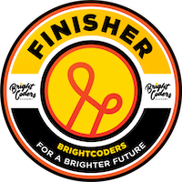

# BrightCoders Awards

Como reconocimiento a su esfuerzo, dedicación y cumplimiento BrightCoders Academy otorga awards a brightcoders y mentores al finalizar cada sprint o kata.

Los awards que se pueden obtener son los siguientes.

## Awards para BrightCoders
Son otorgados por BrightCoders Academy de acuerdo a los siguientes criterios.

### Top Coder
Insignia | Criterios
--- | ---
 | Se otorga a los brightcoders que cumplen con los requerimientos del reto o sprint y terminan dentro del tiempo establecido
 | Se otorga a los brightcoder que cumplen con todos o la mayoría de los requerimientos y terminan dentro del tiemp extendido establecido

## Awards para Mentores
Los BrightCoders son quienes otorgan insignias a los mentores en reconocimiento a su apoyo durante la realización de un reto o un sprint, ya sea participando en las sesiones de live coding, ayuda en #support, o alguna actividad relevante que ayudó al desarrollo de sus tareas o resolución de dudas.

Las insignias de mentores reconocen
- **Dedicación**. Se otorgan puntos de dedicación por el tiempo que dedicaron a ayudar a los BrightCoders. La dedicación se mide en Give Back Points (GBP) y corresponden a un tercio del tiempo que los BrightCoders dedicaron para completar su reto o sprint. Por ejemplo si para un reto los BrightCoders dedicaron 10 horas, el mentor recibirá 3 GBPs.
- **Impacto**. Tiene que ver con el número de BrightCoders que otorgan o reconocen el apoyo del mentor
  - Platinum. Reconocimiento de 5 o más BrightCoders
  - Gold. Reconocimiento de 3 o 4 BrightCoders
  - Silver. Reconocimiento de 1 o 2 Brightcoders

Platinum | Gold | Silver
--- | -- | --
 |  |  | 
