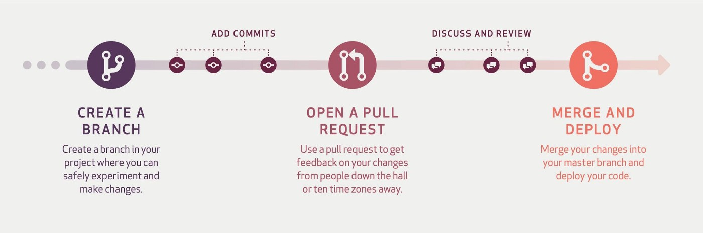
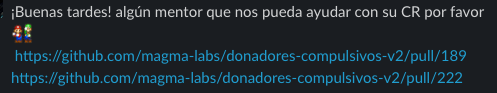

# Pull Request


En su forma más simple, los Pull Request son un mecanismo para que los desarrolladores notifiquen a los miembros de su equipo que han terminado una función.

Una vez que la rama de función está lista, el desarrollador realiza la solicitud de incorporación de cambios. Así, todas las personas involucradas saben que deben revisar el código y fusionarlo con la rama `MASTER`.

Un Pull Request (PR) representa una forma de entregar valor a la aplicación en la forma de un conjunto de cambios que juntos forman una funcionalidad de alto nivel.

Una **mala práctica**  en los Pull Request es hacer cambios en cosas que no tienen que ver con la funcionalidad que se está implementando. Si hay cambios que se necesitan hacer pero no tienen que ver con la funcionalidad que se están implementando entonces deberían trabajarse en un pull request diferente.

## Flujo de trabajo recomendado

Para realizar un PULL REQUEST te recomendamos utilizar el siguiente flujo de trabajo
1. Cada PR  contiene un conjunto de cambios (uno o más [commits significativos](https://medium.com/better-programming/you-need-meaningful-commit-messages-d869e44e98d4)) [que tienen  que ver con una funcionalidad que es atómica y específica](https://medium.com/@fagnerbrack/one-pull-request-one-concern-e84a27dfe9f1).
2. Antes de iniciar a trabajar en una nueva funcionalidad debes crear una nueva rama
3. El [nombre de la rama](https://gist.github.com/digitaljhelms/4287848) debe suficientemente claro como para dar una idea de la funcionalidad que se implementa
4. Una vez situado en nueva rama creada, comenzás a implementar la solución e incorporar pequeños cambios en la forma de  [commits significativos](https://medium.com/better-programming/you-need-meaningful-commit-messages-d869e44e98d4)
5. Al termar abrirás un PR mediante el cual recibirás retroalimentación de tus compañeros y mentores y atenderás los cambios solicitados.
6. Al abrir tu PR deberás llenar una plantilla como la que se muestra a continuación:

```
<!--- PR Title: What changed/implement in this PR? -->
<!--- Be specific, don't you write a generic title please --> 

## Description: Why did you change/implement that?
<!-- Describe your changes indetail -->

## Testing: Help me how can I test or look at the changes?
<!-- Please describe in detail how you tested your changes or use screenshots -- 
```
7. Para solicitar retroalimentación a tus compañeros y mentores deberás publicar en el canal #support de Slack la URL de tu PR y un mensaje en donde solicites la revisión de tu códibo (Code Review (CR)), como se muestra en el siguiente ejemplo:

8. Una vez que obtengas la aprobación de por lo menos 1 de tus mentores podrás hacer el Merge an Deploy

Todos los mentores y brightcoders pueden hacer Code Review (CR) de los PR, además de dar retroalimentación a tus compañeros esta también es una forma de de aprender así que haz CR cada vez que puedas.

## Requerimiento


## Enlaces
Para conocer más sobre como trabajar tus commits y pull requests es recomendable que leas lo siguientes enlaces:
### Commits
- [You Need to Write Meaningful Commit Messages](https://medium.com/better-programming/you-need-meaningful-commit-messages-d869e44e98d4) 
- [Writing meaningful git commit messages](https://medium.com/@menuka/writing-meaningful-git-commit-messages-a62756b65c81)
- [How to Write a Git Commit Message](https://chris.beams.io/posts/git-commit/)
### Pull Requests
- [One Pull Request. One Concern](https://medium.com/@fagnerbrack/one-pull-request-one-concern-e84a27dfe9f1)
- [The (written) unwritten guide to pull requests](https://www.atlassian.com/blog/git/written-unwritten-guide-pull-requests)
- [Best practices for pull requests](https://github.community/t/best-practices-for-pull-requests/10195)
- [BEST PRACTICES ON DOING PULL REQUESTS](https://holgerfrohloff.de/best-practices-on-doing-pull-requests/)
- [What every reviewer would like to see in your next Pull Request](https://nebulab.it/blog/what-every-reviewer-would-like-to-see-in-your-next-pull-request/?utm_content=bufferbd023&utm_medium=social&utm_source=twitter.com&utm_campaign=buffer)

