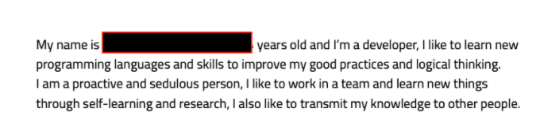
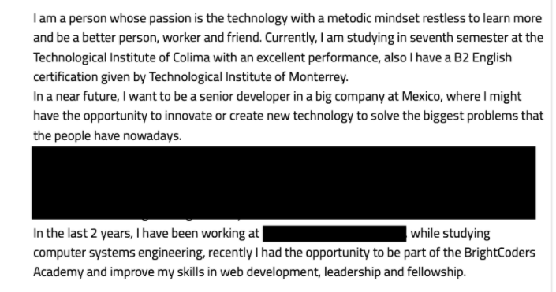
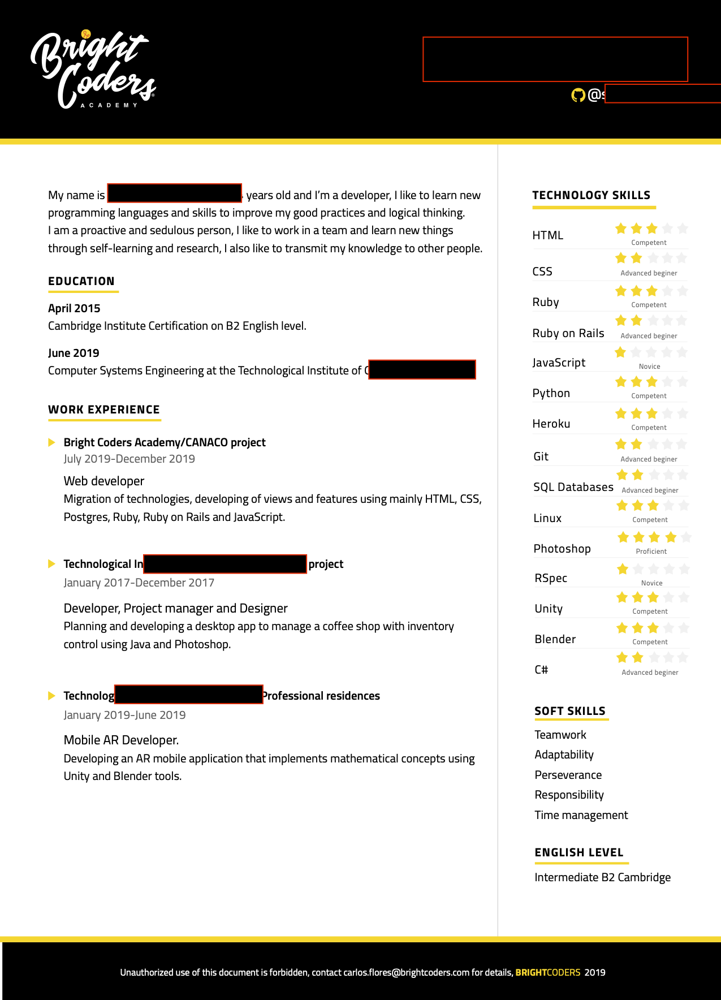
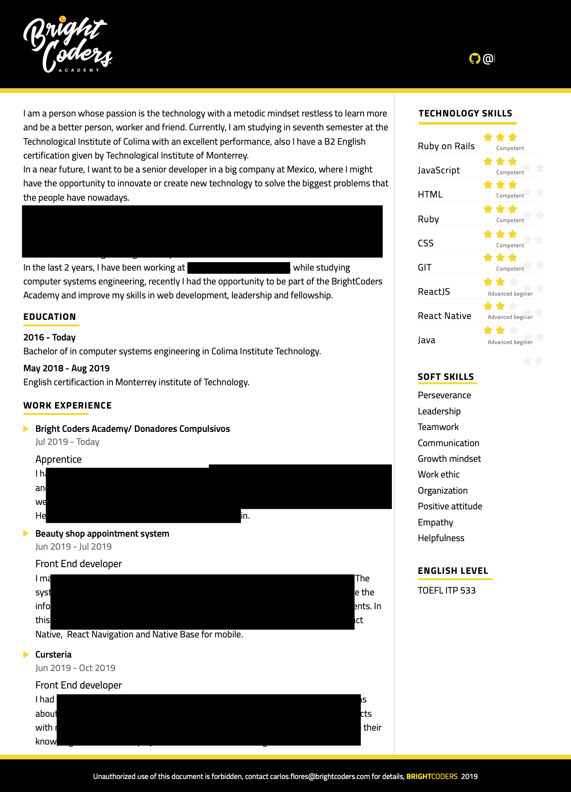

# Curriculum Vitae

El propósito de esta actividad es tener un perfil completo de nuestros BrightCoders. 

## Instrucciones

1. Para construirlo utilizaremos el formato [JSON resume](https://jsonresume.org/)
2. Edita el archivo [resume.json](resume.json)
3. No es necesario que incluyas información en todas las secciones, utiliza solo las que apliquen.
4. De preferencia escribe tu CV en inglés.
5. Compártelo que alguien que tenga buen nivel de inglés para que lo revise y te ayude a mejorarlo.
6. Si no tienes el nivel suficiente de inglés puedes hacerlo en español

## Modelo Dreyfus

Para indicar el tu nivel de experiencia en cada habilidad (skill) utilizaremos el modelo de Dreyfus el cual considera los siguientes niveles:
- Novice
- Advanced Beginner
- Competent
- Proficient
- Expert

Utiliza los siguientes enlaces para entender de que trata cada nivel para poder ubicarte en el que te corresponde.
- [How To Evaluate Expertise: the Dreyfus Model](https://www.solcept.ch/en/blog/dreyfus-model/)
- [Building Software Development Expertise – Using The Dreyfus Model](https://skorks.com/2009/08/building-software-development-expertise-using-the-dreyfus-model/)
- [Software Engineer Qualification Levels: Junior, Middle, and Senior](https://hackernoon.com/software-engineer-qualification-levels-junior-middle-and-senior-f2229591df1c)

## Basics
### label
Escribe Ruby on Rails Web Developer o React Native Mobile Developer

### Picture, Image
Deja estos campos como estan, no necesitas agregar nada

### Summary
Escribe un breve descripción sobre tu perfil. Por ejemplo:

## Profiles
Agrega todos los perfiles que consideres relevantes: facebook, twitter, linkedin, etc.

## Work
Agrega todos los trabajos o proyectos en los que has participado

## Volunteer

Si haz participado agrega información, si no elimina toda esta sección,

## Education
Estudios realizados de nivel Licenciatura en adelante. También puedes incluir cursos que consideres relevantes.

## Awards
Si es que haz recibido algún premio o reconocimiento. Si no, elimina esta sección

## Skills
En esta sección registra tus habilidades técnicas de la siguiente forma:

- Name: Nombre de la habilidad. Por ejemplo, HTML, CSS, React, PHP, PostgreSQL, etc.
- Level: El que corresponda de acuerdo al Modelo Dreyfus
- Keywords: Las que se relacionen con el skill. -por ejemplo, databases, queries, responsive design, etc.

## Softskills
Se refiere a las habilidades intrapersonales. Escribe aquellas que te caracterizan.

- Name: Nombre de la habilidad, por ejemplo, Teamwork, communication, Willigness to learn, etc.
- Level: Accquired (aplica para todos los casos)

Algunos de los softskills reconocidos por las empresas son:

- [10 Soft Skills Every Developer Needs](https://hackernoon.com/10-soft-skills-every-developer-needs-66f0cdcfd3f7)
- [Top 7 Soft Skills for Developers in 2019](https://simpleprogrammer.com/soft-skills-2019/)
- [Critical soft skills for software developers](https://medium.com/swlh/critical-soft-skills-for-software-developers-6845545f6dbd)

## Languages

Para el caso de inglés, si no tienes TOEFL pero otra certificación o nivel de inglés, registralo entre paréntesis. Si no tienes este dato elimina los paréntesis.

## Ejemplos

Estos son algunos ejempos de scorecards que otros Brightcoders escribieron.
NO hagas una copia de ellos simplemente utilizalos para darte una idea del tipo de información que puedes incluir. Siempre hay espacio para mejorar.

