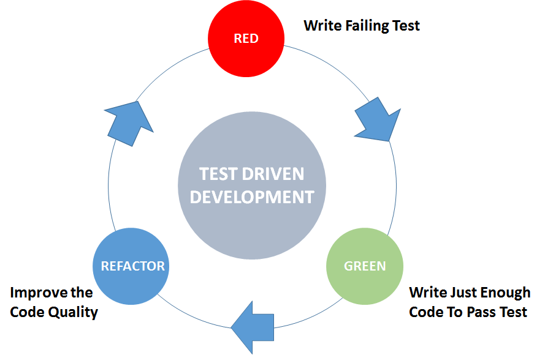

# Test Driven Development (TDD)

El desarrollo basado en pruebas o Test Driven Development, es la práctica de escribir primero las pruebas, para después utilizar esas pruebas como guia para escribir nuestri código. Esto puede sonar un poco raro, pero resulta que hace que la escritura de código sea más fácil. Proporciona un claro fluho de trabajo y los pasos a seguir mientras estás codificando y tiene el benificio adicional de generar una suite de pruebas en la cual puedes confiar.

En BrightCoders somos promotores del uso de esta práctica por lo que TODOS tus programas deberán incluir pruebas

## Mini Taller

En los siguientes videos Eduardo Hernández ingeniero de [MagmaLabs](https://www.magmalabs.io/) hace una breve introducción al Test Driven Development utilizando Ruby y [Rspec](https://rspec.info/).

### Parte 01 

### Parte 02

### Materiales
- [Código fuente de los ejemplos del video](https://github.com/bright-coders/tdd-workshop)
- [Diapositivas del taller](https://drive.google.com/file/d/17jU3Yz5xJmx82rZWoVv7QaJoW9Na4Rif/view?usp=sharing)

## Recursos

Para aprender más sobre TDD te recomendamos los siguientes enlaces: 
- [UPCASE Learn Testing](https://thoughtbot.com/upcase/testing)
- [UPCASE Fundamentals of TDD](https://thoughtbot.com/upcase/fundamentals-of-tdd)
- [UPCASE Test Driven With Rails](https://thoughtbot.com/upcase/test-driven-rails)
- [UPCASE Rails Testing Exercises](https://thoughtbot.com/upcase/rails-testing-exercises)
- [UPCASE Test doubles](https://thoughtbot.com/upcase/test-doubles) 
- [Ruby Joans](http://www.rubykoans.com/

